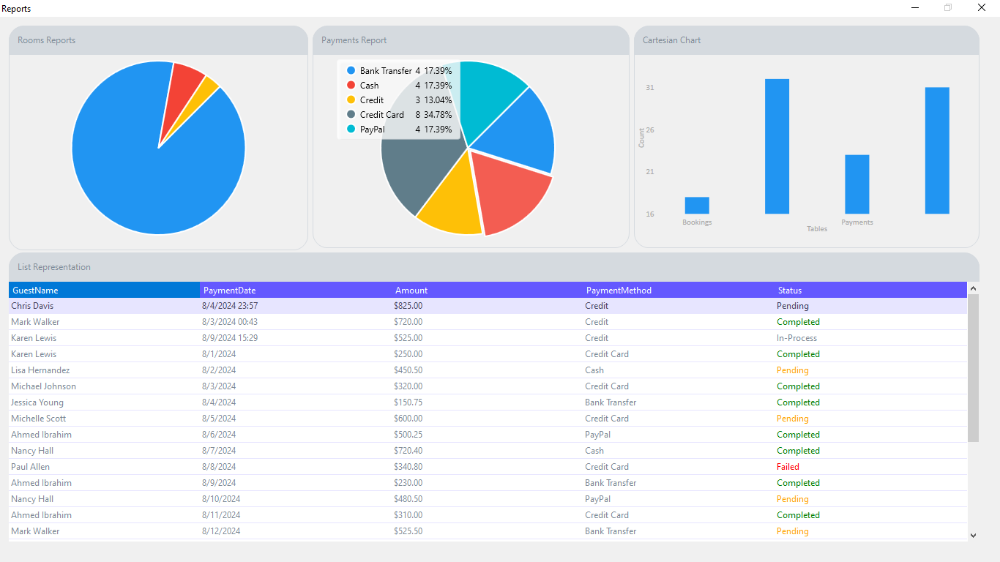
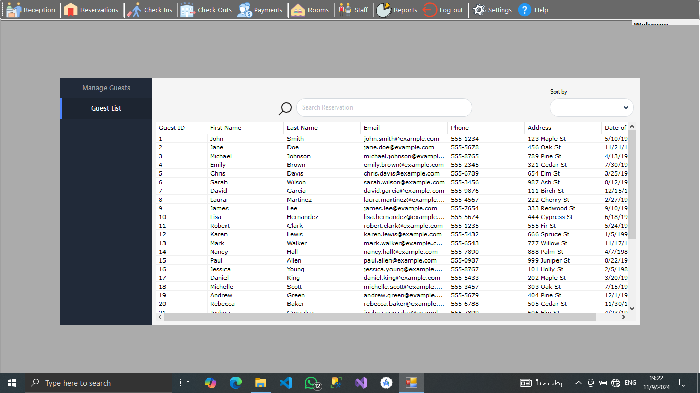
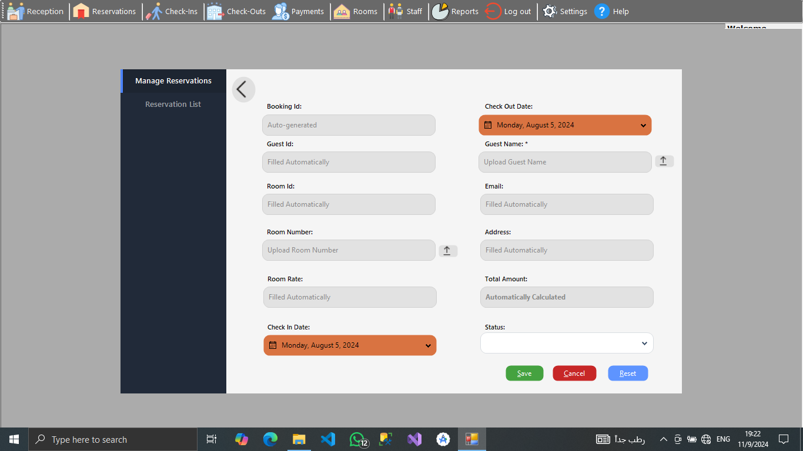
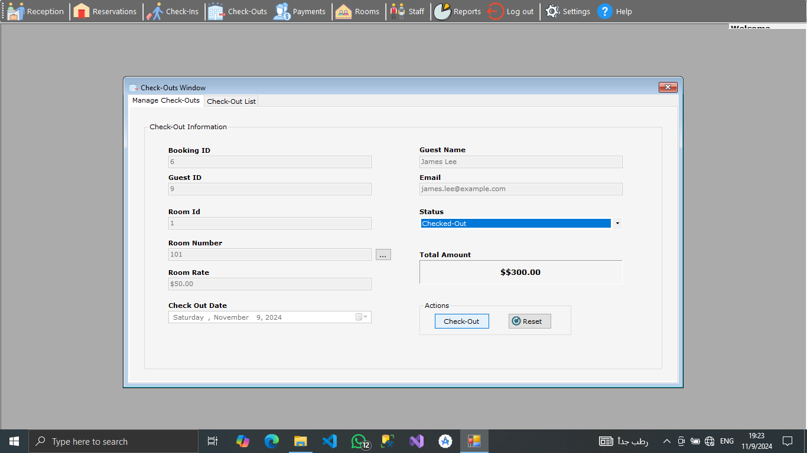
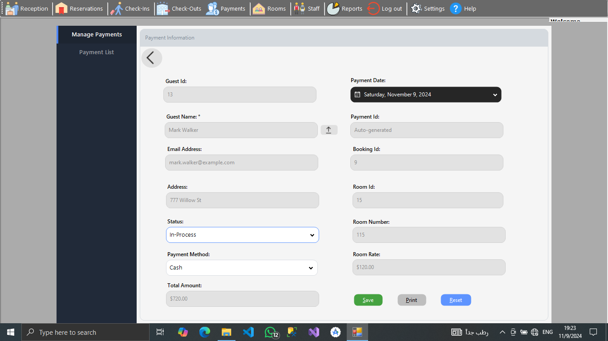

# Hotel Management System - WinForms

A hotel management system built with C# and Windows Forms, featuring MSSQL Server integration. This application provides an intuitive interface for managing guests, reservations, check-ins, check-outs, room availability, and payments, with security and user experience enhanced using Guna UI and LiveCharts.

## Features

- **Secure Login**: Only authorized users can access the system.
- **User-Friendly Dashboard**: Provides an overview of operations with visual data.
- **Guest Management**: Simplifies guest record management.
- **Reservations**: Allows easy booking and tracking of guest reservations.
- **Check-In and Check-Out**: Manages guest check-ins and check-outs.
- **Room Management**: Controls room availability, types, and assignments.
- **Payments**: Tracks and records guest payments.

## Tech Stack

- **Frontend**: C# WinForms with Guna UI for styling
- **Database**: Microsoft SQL Server
- **Data Visualization**: LiveCharts for charts and graphs

## Installation

### Clone the Repository

```bash
git clone https://github.com/MasterWithAhmad/HotelMS.git
cd HotelMS
```

## Configure the Database

1. Create a new database in Microsoft SQL Server.
2. Update the connection string in the `App.config` file to match your SQL Server setup.

## Build and Run the Application

1. Open the solution in Visual Studio.
2. Restore NuGet packages if prompted.
3. Build the solution: `dotnet build`
4. Run the application: `dotnet run`

## Usage

1. **Login**: Use the secure login screen to enter the system.
2. **Dashboard**: Access the main dashboard for quick insights and data visualizations.
3. **Guest Management**: Add, update, or delete guest records as needed.
4. **Reservations**: Manage bookings with easy-to-use reservation options.
5. **Check-In/Check-Out**: Record guest arrivals and departures.
6. **Room Management**: View room availability, add new rooms, and assign guests to rooms.
7. **Payments**: Log payments and view payment history.

## Screenshots

### Dashboard


### Guest Management


### Reservations


### Check-In and Check-Out


### Room Management


### Payments


## Contributing

Contributions are welcome! Follow these steps to contribute:

1. **Fork the Repository**: Click the "Fork" button at the top.
2. **Clone the Forked Repo**: `git clone https://github.com/MasterWithAhmad/HotelMS.git`
3. **Create a Branch**: `git checkout -b feature/YourFeatureName`
4. **Make Your Changes**: Implement your feature or fix.
5. **Commit and Push**:
   - `git add .`
   - `git commit -m "Add feature: YourFeatureName"`
   - `git push origin feature/YourFeatureName`
6. **Open a Pull Request**: Go to the repository on GitHub and open a PR to the main branch.

## License

This project is licensed under the MIT License. See the [LICENSE](LICENSE) file for details.

## Acknowledgments

- **Guna UI** for enhancing the UI/UX.
- **LiveCharts** for dynamic and interactive data visualization.
- **Microsoft SQL Server** for data storage and management.

Feel free to explore and customize the system as needed!
